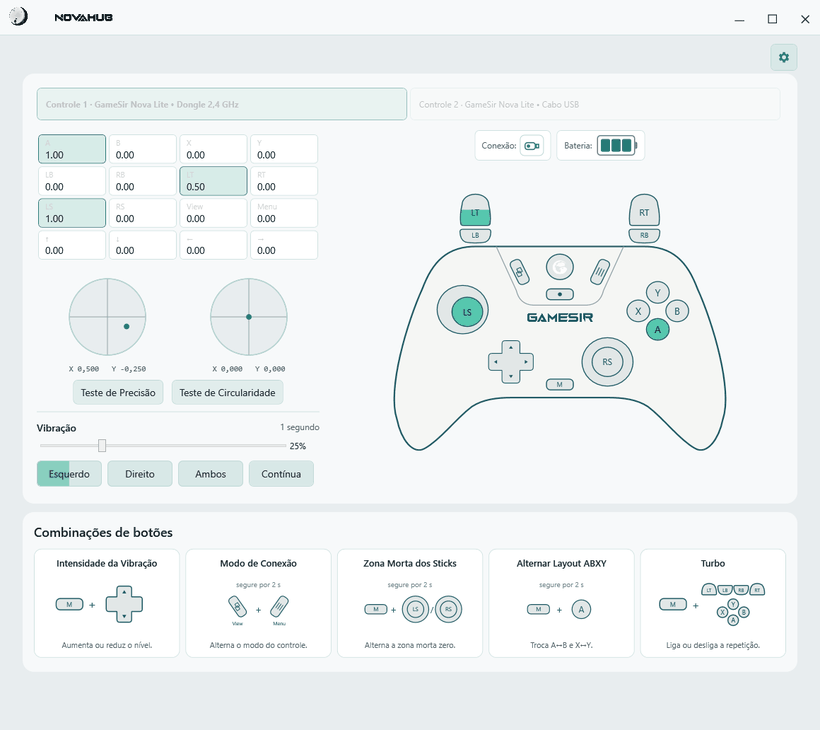
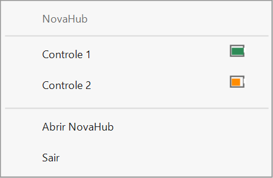
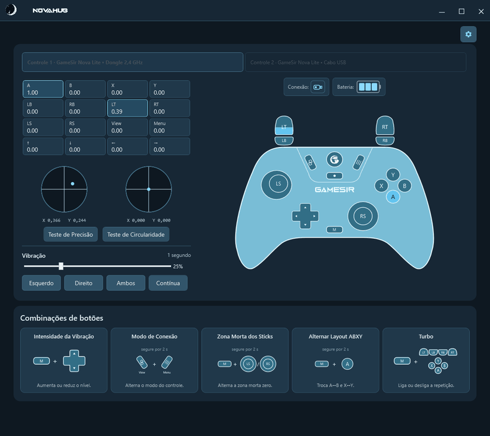
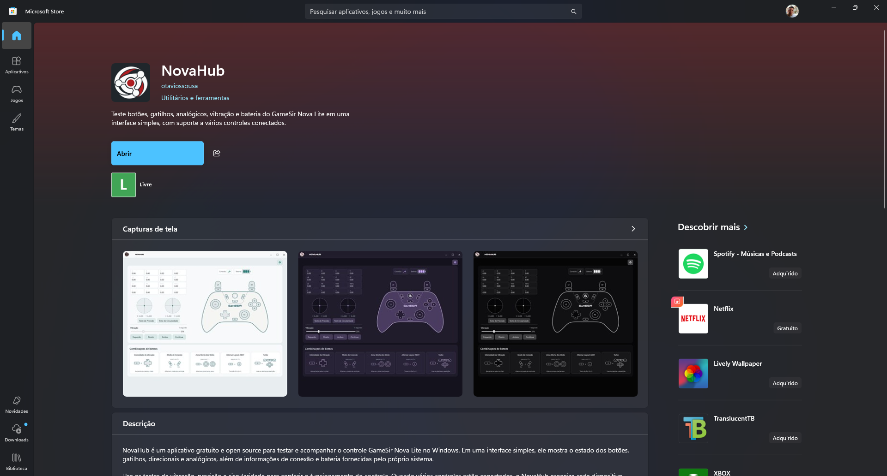

<p align="center">
  <b><a href="README.md">🇧🇷 Português</a></b> &nbsp;•&nbsp; <b><a href="README.en.md">🇺🇸 English</a></b>
</p>

<br> <br> 

<p align="center">
  <picture>
    <source media="(prefers-color-scheme: dark)" srcset="src/NovaLite.Desktop/Assets/NovaHub_White_Icon.png">
    <source media="(prefers-color-scheme: light)" srcset="src/NovaLite.Desktop/Assets/NovaHub_Black_Icon.png">
    
  </picture>
</p>

<p align="center">
  <picture>
    <source media="(prefers-color-scheme: dark)" srcset="src/NovaLite.Desktop/Assets/NovaHub_Logo_White_No_Icon.png">
    <source media="(prefers-color-scheme: light)" srcset="src/NovaLite.Desktop/Assets/NovaHub_Logo_Black_No_Icon.png">
    
  </picture>
</p>

<p align="center">
  A free, modern, open-source dashboard to test, calibrate, and monitor GameSir Nova Lite controllers on Windows.
</p>

<p align="center">
  <a href="https://github.com/otaviossousa/NovaHub/releases/latest"></a>
</p>

<p align="center">
  
  
  
</p>

---

## About the project

**NovaHub** is a Windows dashboard made for those who use the **GameSir Nova Lite** and want more control over their own controller.

In a single interface, you can test inputs in real time, check the precision and circularity of the analog sticks, and test the vibration of each motor.

**NovaHub** was designed to be **lightweight, simple, and unobtrusive**. You can connect up to **4 controllers simultaneously**, each in its own tab, and leave the app running in the background from the Windows system tray, tracking the status and battery of your devices without needing to keep the window open.

**NovaHub** is **100% free, portable, open source, ad-free, and has no telemetry**.

Built to test, monitor, and get the most out of your controller.


> NovaHub is an independent, community-driven open-source project and is not officially affiliated with GameSir.

---

## Interface

The **NovaHub** interface was designed to match the different color variants of the GameSir Nova Lite.



### Discrete system tray monitoring

When minimizing or closing the main window, the application goes to the **Windows notification area (system tray)**. Through the context menu, you can check at any time how many controllers are paired and the battery level of each one, without interfering with your gameplay.

<p align="center">
  
</p>

---

## Battery and connection modes

The GameSir Nova Lite can connect to Windows through different operating modes. Therefore, how battery and connection details are displayed varies depending on the active technology:



### How each mode behaves

* **2.4 GHz USB Dongle**: In this mode, the controller communicates via XInput. Battery status is categorized into the official standard tiers: **Empty**, **Low**, **Medium**, or **Full**.
* **Direct USB Cable**: Wired mode with the lowest possible latency and continuous power supply. The controller remains powered during use.
* **Bluetooth (Switch, DualShock 4, or Android)**: On compatible Bluetooth connections, NovaHub reads extended HID reports to identify the device and report battery level when provided by the firmware.
* **Data Integrity Policy**: NovaHub prioritizes official data sources. If a given connection mode does not supply reliable telemetry, the application displays the status as unavailable (`?`).

---

## How to download and use

### Option 1: Microsoft Store

The project is available on the **Microsoft Store**, access [NovaHub](https://apps.microsoft.com/detail/9NDD0QW2VXMS?hl=pt-br&gl=BR&ocid) directly from the official store on your PC and enjoy.

<p align="center">
  
</p>


### Option 2: Portable Package

1. Open the [official Releases page](https://github.com/otaviossousa/NovaHub/releases/latest).
2. Download `NovaHub-<version>-win-x64.zip`.
3. Extract the contents to any folder of your choice.
4. Run `NovaHub.exe`.

> [!TIP]
> The executable is 100% self-contained: no installation required, and no separate .NET Runtime needed. Compatible with 64-bit Windows 10 and Windows 11.

> [!NOTE]
> Windows SmartScreen may show a one-time notice on first launch because the executable is open source and unsigned. Always ensure you download packages from the official GitHub Releases page of this repository.

---

## Privacy and security

* **Zero telemetry**: No telemetry, analytics, or usage logs are ever recorded externally.
* **Local persistence**: All readings, language, and theme preferences remain strictly stored on your computer.
* **Non-invasive**: NovaHub does not modify the controller's firmware or overwrite permanent calibration memories.
* **Transparent networking**: External links (official manual, author profile, and repository) are only opened when you deliberately click on them in the settings.

---

## Building from source

If you want to inspect the code, contribute, or create your own local build:

### Prerequisites

* Windows 10 or Windows 11 (64-bit);
* .NET 10 SDK installed;
* PowerShell 5.1 or higher.

### Compilation and testing

Clone the repository and run in PowerShell:

```powershell
.\build.ps1
```


To generate the same portable ZIP package provided in official Releases:

```powershell
.\build.ps1 -Package
```

The portable ZIP and its SHA-256 checksum are saved to `artifacts/<version>/portable/`.
The Microsoft Store MSIX package and its checksum are saved to `artifacts/<version>/store/`.

---

## Official controller documentation

To check factory manuals, manual calibration instructions, and hardware pairing procedures, visit the [Official GameSir Nova Lite Manual](https://gamesir.com/pt-BR/support/manuals/gamesir-nova-lite).

---

## Contributing to the project

NovaHub is open source. You can study the code, create a fork, and adapt it to your own needs. Issues, suggestions, and pull requests are welcome; improvements aligned with the application's goals can be reviewed and incorporated into the project.

Read the [contributing guide](CONTRIBUTING.md) before submitting a change.

## Developer and support

Developed by [Otavio Sousa](https://github.com/otaviossousa).

If this project was useful to you and you would like to help with any amount, feel free. Contributions are entirely optional and NovaHub will remain free: [GitHub Sponsors](https://github.com/sponsors/otaviossousa).

## License

Distributed under the [MIT License](LICENSE). You may use, copy, modify, and redistribute the code, provided you retain the copyright notice and license terms.
