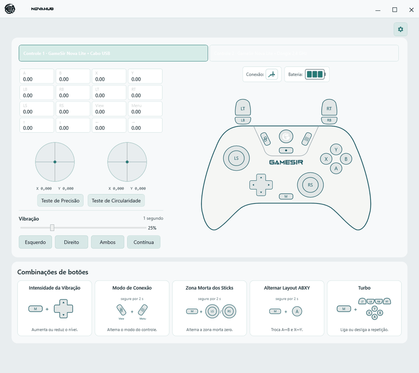
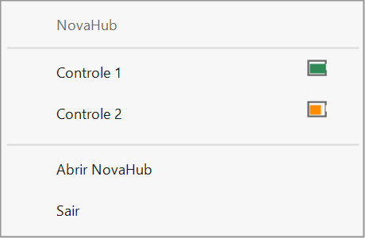

<p align="center">
  <picture>
    <source media="(prefers-color-scheme: dark)" srcset="src/NovaLite.Desktop/Assets/NovaHub_White_Icon.png">
    <source media="(prefers-color-scheme: light)" srcset="src/NovaLite.Desktop/Assets/NovaHub_Black_Icon.png">
    
  </picture>
</p>

<p align="center">
  <picture>
    <source media="(prefers-color-scheme: dark)" srcset="src/NovaLite.Desktop/Assets/NovaHub_Logo_White_No_Icon.png">
    <source media="(prefers-color-scheme: light)" srcset="src/NovaLite.Desktop/Assets/NovaHub_Logo_Black_No_Icon.png">
    
  </picture>
</p>

<p align="center">
  Uma central gratuita e open source para testar e acompanhar controles GameSir Nova Lite no Windows.
</p>

<p align="center">
  <a href="https://github.com/otaviossousa/NovaHub/releases/latest"></a>
</p>

<p align="center">
  
  
</p>

## Sobre o projeto

O NovaHub foi criado para oferecer uma forma simples de conferir o funcionamento do GameSir Nova Lite no Windows. Em uma única tela, é possível visualizar os comandos enviados pelo controle, testar analógicos, gatilhos, botões e vibração, além de acompanhar as informações de bateria disponibilizadas por cada modo de conexão.

Quando a janela é minimizada ou fechada, o NovaHub permanece na área de ícones ocultos do Windows. Por esse menu, você pode conferir rapidamente quantos controles estão conectados e visualizar o nível de bateria de cada um sem precisar manter o aplicativo aberto na tela.

O projeto é gratuito, não possui anúncios, telemetria ou recursos pagos. Seu objetivo é disponibilizar uma ferramenta útil para quem possui o controle e quer verificar seu funcionamento de maneira clara, sem depender de uma plataforma de jogos.

> O NovaHub é um projeto independente e não possui vínculo oficial com a GameSir.

## Interface



### Monitoramento nos ícones ocultos

Ao minimizar ou fechar a janela, o NovaHub continua mostrando os controles conectados e o nível de bateria de cada um no menu dos ícones ocultos do Windows.



## Principais recursos

- visualização em tempo real de botões, direcionais, analógicos e gatilhos;
- teste de precisão dos analógicos;
- teste de circularidade com representação visual do movimento;
- teste de vibração individual ou simultâneo dos motores;
- identificação dos modos Dongle 2,4 GHz, cabo USB, Switch, DualShock e Android;
- leitura do nível de bateria quando disponibilizado pelo protocolo do controle;
- exibição da bateria de vários controles na área de ícones ocultos do Windows;
- tratamento de interfaces duplicadas para evitar contar uma única conexão como vários controles;
- combinações de botões do Nova Lite apresentadas visualmente;
- temas inspirados nas cores do controle;
- interface disponível em português e inglês.

## Baixar e usar

1. Abra a página da [versão mais recente](https://github.com/otaviossousa/NovaHub/releases/latest).
2. Baixe `NovaHub-<versão>-win-x64.zip`.
3. Extraia todo o conteúdo do ZIP para uma pasta.
4. Execute `NovaHub.exe`.

O pacote é portátil: não precisa ser instalado e não exige uma instalação separada do .NET. Ele é destinado ao Windows 10 ou Windows 11 de 64 bits.

O Windows pode exibir um aviso do SmartScreen porque o executável ainda não possui assinatura digital. Antes de executá-lo, confirme que o arquivo foi baixado da página oficial de Releases deste repositório.

## Bateria e modos de conexão

O Nova Lite pode se apresentar ao Windows de maneiras diferentes dependendo do modo escolhido no controle. Por isso, a informação de bateria pode variar entre uma categoria — vazia, baixa, média ou cheia — e uma estimativa percentual.

O NovaHub exibe apenas informações fornecidas por fontes reconhecidas. Quando o modo de conexão não disponibiliza um nível confiável, o aplicativo informa que a leitura não está disponível em vez de inventar uma porcentagem.

## Privacidade e segurança

- não existe telemetria;
- nenhuma leitura do controle é enviada pela internet;
- as preferências de tema e idioma ficam armazenadas localmente;
- o NovaHub não atualiza firmware;
- o aplicativo não altera configurações permanentes do controle;
- links externos só são abertos quando você seleciona uma opção na área de configurações.

## Documentação do controle

As instruções de pareamento, calibração, combinações e funcionamento do controle estão disponíveis no [manual oficial do GameSir Nova Lite](https://gamesir.com/pt-BR/support/manuals/gamesir-nova-lite).

## Compilar o código-fonte

Pré-requisitos:

- Windows 10 ou Windows 11;
- SDK do .NET 10;
- PowerShell.

Clone o repositório e execute:

```powershell
.\build.ps1
```

O script restaura as dependências, compila a aplicação e executa as 61 verificações do projeto. Para gerar o mesmo ZIP portátil disponibilizado nas Releases:

```powershell
.\build.ps1 -Package
```

Os arquivos gerados ficam em `artifacts` e não são incluídos no histórico do Git.

## Contribuir com o projeto

O NovaHub é open source. Você pode estudar o código, criar um fork e fazer adaptações para suas próprias necessidades. Issues, sugestões e pull requests são bem-vindos; melhorias alinhadas ao objetivo do aplicativo podem ser revisadas e incorporadas ao projeto.

Leia o [guia de contribuição](CONTRIBUTING.md) antes de enviar uma alteração.

## Desenvolvedor e apoio

Desenvolvido por [Otavio Sousa](https://github.com/otaviossousa).

Se o projeto foi útil para você e quiser contribuir com algum valor, fique à vontade. A contribuição é totalmente opcional e o NovaHub continuará gratuito: [GitHub Sponsors](https://github.com/sponsors/otaviossousa).

## Licença

Distribuído sob a [Licença MIT](LICENSE). Você pode usar, copiar, modificar e redistribuir o código, desde que mantenha o aviso de copyright e os termos da licença.
